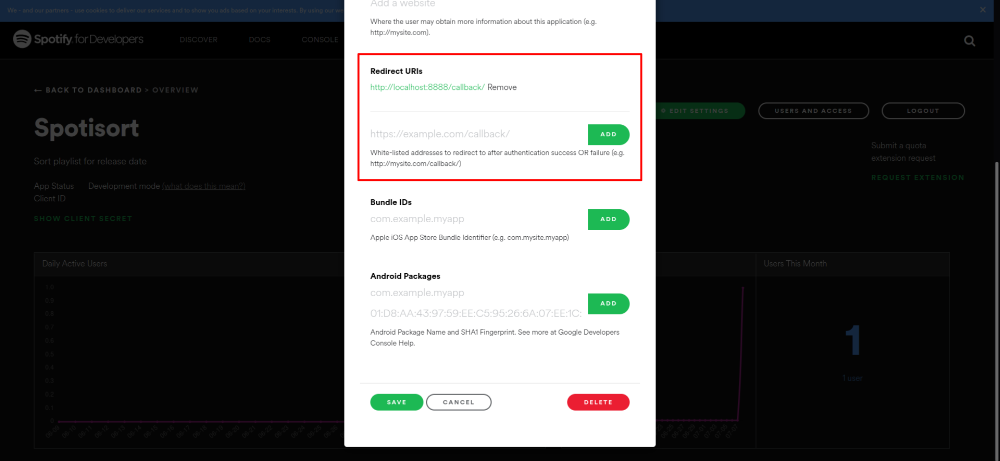
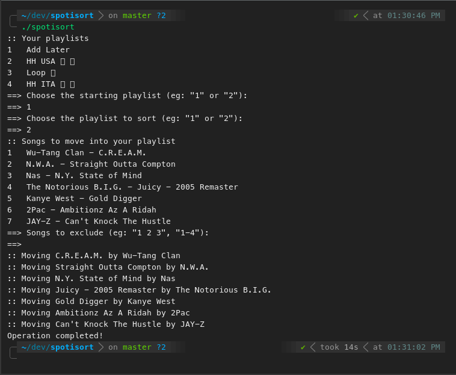

# Spotisort
Spotisort is a small script to sort Spotify playlists by release date. It allows your playlist to stay tidy and keep new releases always on top.

## Requirements
- Spotipy module (`pip3 install spotipy`)
- A [Spotify app](https://developer.spotify.com/dashboard/applications)
- To whitelist your Redirect URI in the Spotify app settings as in figure
- A [Genius token](https://genius.com/api-clients/new) (optional)



## Installation
```
git clone https://github.com/alessiocelentano/spotisort
```
 
Remember to edit `config.ini` with the data you got from the Spotify app.

## Usage
``` bash
# Genius search active (if configured). Incomplete release date will be searched on Genius.
$ ./spotisort

# Don't search release dates on Genius. Faster but less accurate.
$ ./spotisort --no-genius
# or
$ ./spotisort -ng
```



 ## License
 MIT
